# 🧪 Aula 8 – Estratégias de Testes

## 🎯 Objetivo da Aula

Compreender e aplicar diferentes **tipos de testes** em microserviços Java — desde **testes unitários** até **testes de integração e ponta a ponta (E2E)** — utilizando o **ecossistema Spring Boot**.

✅ Após esta aula, você será capaz de:

* Implementar **testes unitários** com *JUnit 5* e *Mockito*.
* Criar **testes de aplicação** e **testes de serviço**.
* Executar **testes de integração** com banco em memória (H2).
* Estruturar **testes E2E** (ponta a ponta) com *Spring Boot Test*.
* Automatizar a execução dos testes via *Maven* e *CI/CD*.

---

## ⚙️ Pré-requisitos 🧑‍💻

* ☕ **Java 21**
* 🍃 **Spring Boot 3.x**
* 🧩 **JUnit 5** e **Mockito**
* 🗄️ **Banco H2**
* 📘 Projeto base: [Aula 7 – Tolerância a Falhas com Resilience4j](https://github.com/alonsodecarli-via/crud-resilience)

---

## 🧱 Tipos de Testes


| Tipo de Teste              | Camada / Foco                                    | Objetivo Principal                             |
| -------------------------- | ------------------------------------------------ | ---------------------------------------------- |
| 🧩 **Unitário**            | Métodos isolados (Service, Utils)                | Validar lógica isolada                         |
| ⚙️ **De Aplicação**        | Classes de negócio com dependências simuladas    | Garantir o comportamento esperado da aplicação |
| 🔗 **De Serviço**          | Comunicação entre camadas (Controller ↔ Service) | Verificar integração interna                   |
| 🧪 **De Integração**       | Aplicação completa com banco de dados real/H2    | Garantir que tudo funcione junto               |
| 🌐 **E2E (Ponta a Ponta)** | API real executando em ambiente real ou mockado  | Validar fluxo completo como usuário final      |

<br>

- A garantia da qualidade funcional e técnica da API passa diretamente pela estratégia de testes, cuidadosamente estruturada com base no conceito da Pirâmide de Testes. Essa pirâmide orienta a priorização dos tipos de testes conforme seu custo, velocidade e retorno.

    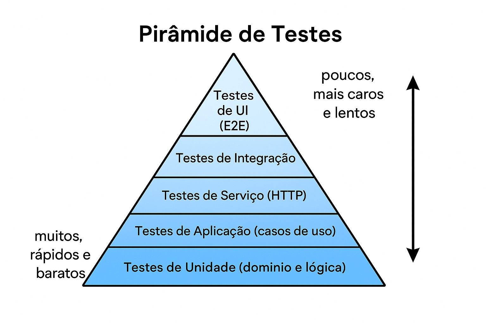

---


## 🧪 Configuração do Maven

- Podemos observar em nosso projeto, nosso arquivo pom.xml já está configurado para suportar testes, por meio da dependência `spring-boot-starter-test`:

    ```xml
    <dependency>
        <groupId>org.springframework.boot</groupId>
        <artifactId>spring-boot-starter-test</artifactId>
        <scope>test</scope>
    </dependency>
    ```

    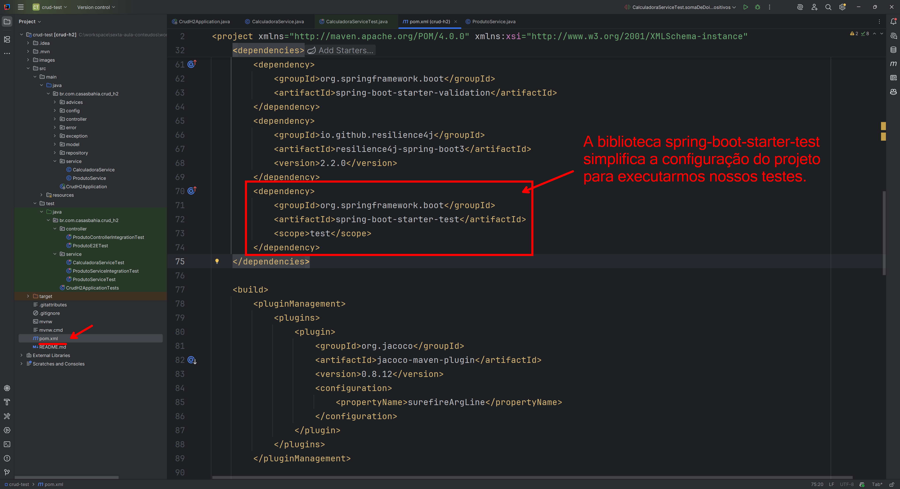

A dependência `spring-boot-starter-test` inclui várias bibliotecas úteis para testes, como JUnit, Mockito, Hamcrest, entre outras. 
Desta forma, não precisamos adicionar cada biblioteca individualmente, simplificando a configuração do projeto para testes.
- JUnit: Framework principal para escrever e executar testes unitários.
- Mockito: Biblioteca para criar mocks e stubs, facilitando o isolamento de unidades de código durante os testes.
- Hamcrest: Biblioteca para criar matchers que tornam as asserções mais legíveis.
- AssertJ: Biblioteca para asserções fluentes e mais expressivas.

<br>


É recomendável fazer algumas configurações adicionais no `pom.xml` para melhorar a experiência de desenvolvimento e disponibilizar recursos avançados de teste, como a geração de relatórios de cobertura de código com JaCoCo.

Outro exemplo que podemos citar é a configuração do plugin `maven-surefire-plugin`, que é responsável por executar os testes durante o ciclo de vida do Maven.


- Segue o arquivo completo de um `pom.xml` configurado para suportar testes unitários, de integração e E2E com Spring Boot:

    ```xml
    <?xml version="1.0" encoding="UTF-8"?>
    <project xmlns="http://maven.apache.org/POM/4.0.0" xmlns:xsi="http://www.w3.org/2001/XMLSchema-instance"
            xsi:schemaLocation="http://maven.apache.org/POM/4.0.0 https://maven.apache.org/xsd/maven-4.0.0.xsd">
        <modelVersion>4.0.0</modelVersion>
        <parent>
            <groupId>org.springframework.boot</groupId>
            <artifactId>spring-boot-starter-parent</artifactId>
            <version>3.5.4</version>
            <relativePath/> <!-- lookup parent from repository -->
        </parent>
        <groupId>br.com.casasbahia</groupId>
        <artifactId>crud-h2</artifactId>
        <version>0.0.1-SNAPSHOT</version>
        <name>crud-h2</name>
        <description>Aula 1 - CRUD com Spring Boot usando o H2</description>
        <url/>
        <licenses>
            <license/>
        </licenses>
        <developers>
            <developer/>
        </developers>
        <scm>
            <connection/>
            <developerConnection/>
            <tag/>
            <url/>
        </scm>
        <properties>
            <java.version>21</java.version>
        </properties>
        <dependencies>
            <dependency>
                <groupId>org.springframework.boot</groupId>
                <artifactId>spring-boot-starter-data-jpa</artifactId>
            </dependency>
            <dependency>
                <groupId>org.springframework.boot</groupId>
                <artifactId>spring-boot-starter-web</artifactId>
            </dependency>

            <dependency>
                <groupId>com.h2database</groupId>
                <artifactId>h2</artifactId>
                <scope>runtime</scope>
            </dependency>
            <dependency>
                <groupId>org.projectlombok</groupId>
                <artifactId>lombok</artifactId>
                <optional>true</optional>
            </dependency>
            <dependency>
                <groupId>org.springdoc</groupId>
                <artifactId>springdoc-openapi-starter-webmvc-ui</artifactId>
                <version>2.8.13</version>
            </dependency>
            <dependency>
                <groupId>org.flywaydb</groupId>
                <artifactId>flyway-core</artifactId>
            </dependency>
            <dependency>
                <groupId>org.springframework.boot</groupId>
                <artifactId>spring-boot-starter-validation</artifactId>
            </dependency>
            <dependency>
                <groupId>io.github.resilience4j</groupId>
                <artifactId>resilience4j-spring-boot3</artifactId>
                <version>2.2.0</version>
            </dependency>
            <dependency>
                <groupId>org.springframework.boot</groupId>
                <artifactId>spring-boot-starter-test</artifactId>
                <scope>test</scope>
            </dependency>
        </dependencies>

        <build>
            <pluginManagement>
                <plugins>
                    <plugin>
                        <groupId>org.jacoco</groupId>
                        <artifactId>jacoco-maven-plugin</artifactId>
                        <version>0.8.12</version>
                        <configuration>
                            <propertyName>surefireArgLine</propertyName>
                        </configuration>
                    </plugin>
                </plugins>
            </pluginManagement>

            <plugins>

                <!-- JaCoCo para cobertura de testes -->
                <plugin>
                    <groupId>org.jacoco</groupId>
                    <artifactId>jacoco-maven-plugin</artifactId>
                    <version>0.8.12</version>
                    <executions>
                        <!-- Prepara o agente antes de rodar os testes -->
                        <execution>
                            <id>prepare-agent</id>
                            <goals>
                                <goal>prepare-agent</goal>
                            </goals>
                        </execution>

                        <!-- Gera o relatório após os testes -->
                        <execution>
                            <id>report</id>
                            <phase>verify</phase>
                            <goals>
                                <goal>report</goal>
                            </goals>
                        </execution>
                    </executions>
                </plugin>

                <!-- Surefire responsável por executar os testes -->
                <plugin>
                    <groupId>org.apache.maven.plugins</groupId>
                    <artifactId>maven-surefire-plugin</artifactId>
                    <version>3.2.5</version>
                    <configuration>
                        <forkCount>1</forkCount>
                        <reuseForks>true</reuseForks>
                        <!--suppress UnresolvedMavenProperty -->
                        <argLine>${surefireArgLine} --add-opens java.base/java.lang=ALL-UNNAMED -XX:+EnableDynamicAgentLoading</argLine>
                    </configuration>
                </plugin>

                <!-- Compiler e Spring Boot -->
                <plugin>
                    <groupId>org.apache.maven.plugins</groupId>
                    <artifactId>maven-compiler-plugin</artifactId>
                    <configuration>
                        <annotationProcessorPaths>
                            <path>
                                <groupId>org.projectlombok</groupId>
                                <artifactId>lombok</artifactId>
                            </path>
                        </annotationProcessorPaths>
                    </configuration>
                </plugin>

                <plugin>
                    <groupId>org.springframework.boot</groupId>
                    <artifactId>spring-boot-maven-plugin</artifactId>
                    <configuration>
                        <excludes>
                            <exclude>
                                <groupId>org.projectlombok</groupId>
                                <artifactId>lombok</artifactId>
                            </exclude>
                        </excludes>
                    </configuration>
                </plugin>

            </plugins>
        </build>


    </project>
    ```

    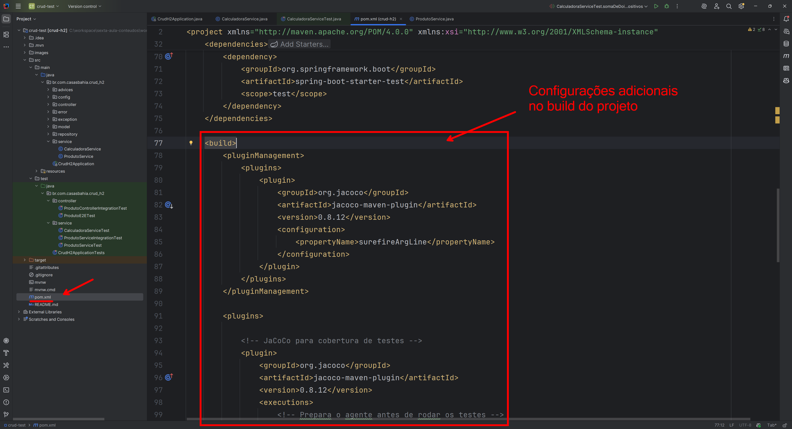


---


## 🧪 O Padrão AAA (Arrange, Act, Assert)

O padrão AAA (Arrange, Act, Assert) é uma abordagem recomendada para estruturar testes de forma clara e legível.

1. **Arrange (Preparar)**: Configura o cenário do teste, incluindo a criação de objetos e a definição de comportamentos esperados.
2. **Act (Agir)**: Executa a ação que está sendo testada, como chamar um método.
3. **Assert (Afirmar)**: Verifica se o resultado da ação está de acordo com o esperado.

### Exemplo de Uso

- Vamos criar um exemplo simples de uma classe de serviço e um teste unitário utilizando o padrão AAA, inicialmente vamos adicionar a classe de serviço: 

    ```java
    package br.com.casasbahia.crud_h2.service;

    import org.springframework.stereotype.Service;

    @Service
    public class CalculadoraService {

        public int somar(int a, int b) {
            return a + b;
        }

        public int subtrair(int a, int b) {
            return a - b;
        }

    }
    ``` 

    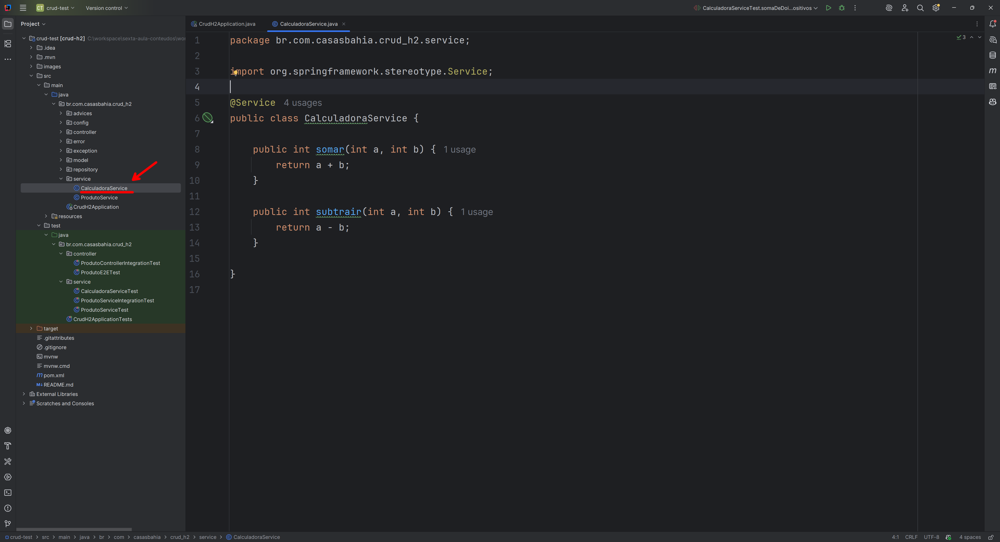

    - podemos utilizar as teclas de atalho `Alt + Insert` (Windows/Linux) ou `Cmd + N` (Mac) para criar a classe de testes do serviço `CalculadoraService`.

    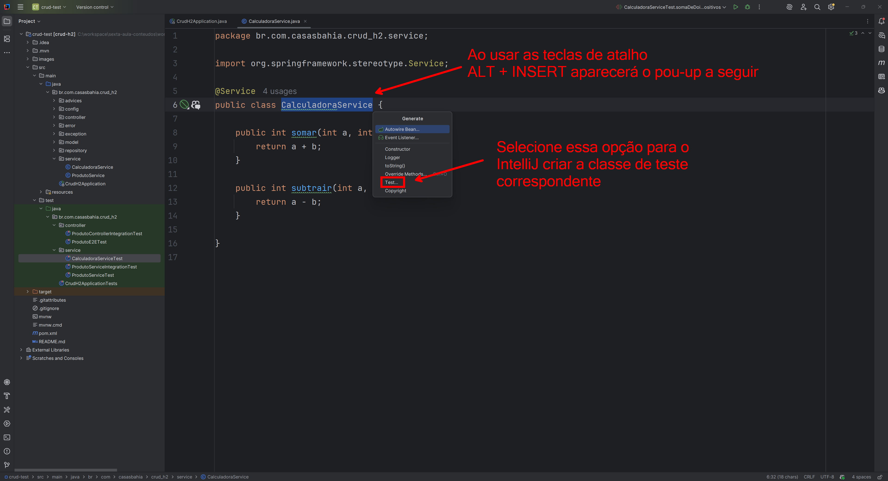


- Agora, vamos criar o teste unitário para a classe `CalculadoraService` utilizando o padrão AAA:

    ```java 
    package br.com.casasbahia.crud_h2.service;

    import org.junit.jupiter.api.DisplayName;
    import org.junit.jupiter.api.Test;

    import static org.junit.jupiter.api.Assertions.*;

    class CalculadoraServiceTest {

        @Test
        @DisplayName("Deve retornar a soma de dois números positivos")
        void somaDeDoisNumerosPositivos() {
            // Arrange → preparar cenário
            CalculadoraService calculadoraService = new CalculadoraService();
            int a = 5;
            int b = 3;
            int resultadoEsperado = 8;

            // Act → executar a ação que queremos testar
            int resultadoAtual = calculadoraService.somar(a, b);

            // Assert → verificar se o resultado está correto
            assertEquals(resultadoEsperado, resultadoAtual);
        }

        @Test
        @DisplayName("Deve retornar a subtração de dois números positivos")
        void subtraiDoisNumerosPositivos() {
            // Arrange
            CalculadoraService calculadoraService = new CalculadoraService();
            int a = 10;
            int b = 4;
            int resultadoEsperado = 6;

            // Act
            int resultadoAtual = calculadoraService.subtrair(a, b);

            // Assert
            assertEquals(resultadoEsperado, resultadoAtual);
        }

    }
    ``` 

    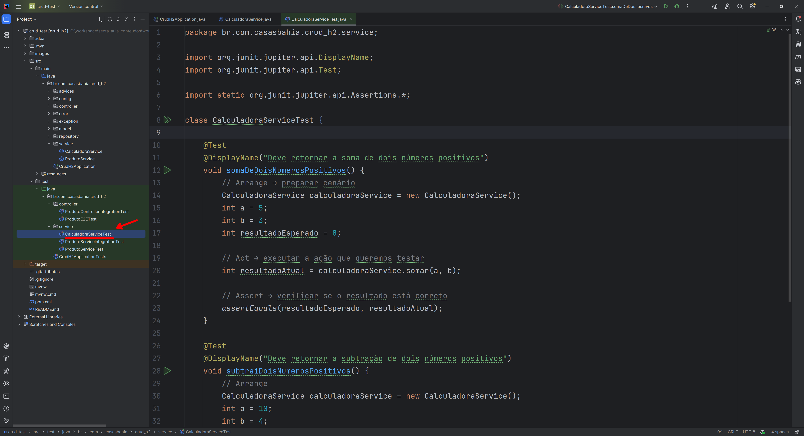

No exemplo acima, cada teste segue o padrão AAA, tornando o código mais organizado e fácil de entender.


---

## 1️⃣ Testes Unitários – *JUnit + Mockito*

Os testes unitários validam **métodos isolados**, sem dependências externas.
Utilizam *JUnit 5* para estruturação e *Mockito* para simular dependências.

### 🧩 Exemplo: `ProdutoServiceTest.java`

- Segue o código completo de um teste unitário para a classe `ProdutoService`, utilizando *JUnit 5* e *Mockito*:

    ```java
    package br.com.casasbahia.crud_h2.service;

    import br.com.casasbahia.crud_h2.exception.ProductNotFoundException;
    import br.com.casasbahia.crud_h2.model.Produto;
    import br.com.casasbahia.crud_h2.repository.ProdutoRepository;
    import org.junit.jupiter.api.BeforeEach;
    import org.junit.jupiter.api.DisplayName;
    import org.junit.jupiter.api.Test;
    import org.mockito.InjectMocks;
    import org.mockito.Mock;
    import org.mockito.MockitoAnnotations;

    import java.math.BigDecimal;
    import java.util.Optional;

    import static org.junit.jupiter.api.Assertions.*;
    import static org.mockito.Mockito.when;

    class ProdutoServiceTest {

        @Mock
        private ProdutoRepository produtoRepository;

        @InjectMocks
        private ProdutoService produtoService;

        private Produto produto;

        @BeforeEach
        void setUp() {
            MockitoAnnotations.initMocks(this);
            produto = new Produto(
                    2L,
                    "Produto Teste",
                    "12345683",
                    "Descrição do Produto Teste",
                    BigDecimal.valueOf(100.0),
                    10
            );
        }

        @Test
        @DisplayName("Deve buscar produto por ID com sucesso")
        void deveBuscarProdutoPorIdComSucesso() {
            // Arrange
            when(produtoRepository.findById(2L)).thenReturn(Optional.of(produto));

            // Act
            Produto resultado = produtoService.buscarPorId(2L);

            // Assert
            assertNotNull(resultado);
            assertEquals(2L, resultado.getId().longValue());
            assertEquals("Produto Teste", resultado.getNome());
            assertEquals(produto, resultado);
        }

        @Test
        @DisplayName("Deve lançar exceção quando produto não for encontrado")
        void deveLancarExcecaoQuandoProdutoNaoEncontrado() {
            // Arrange
            when(produtoRepository.findById(99L)).thenReturn(Optional.empty());

            // Act & Assert
            assertThrows(ProductNotFoundException.class, () -> produtoService.buscarPorId(99L));
        }

    }
    ```

    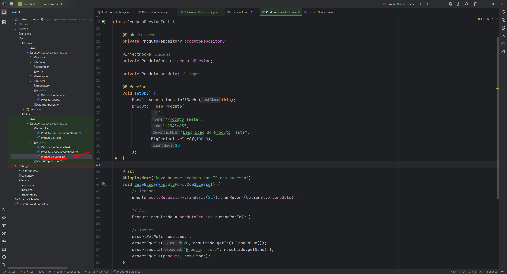

✅ **Destaques:**
* `@Mock` → simula dependências externas (recurso simulado), ou seja, cria um mock (objeto falso) de uma classe ou interface, controlado pelo Mockito.
* `@InjectMocks` → injeta automaticamente mocks no serviço (recurso real com mocks injetados), ou seja, cria uma instância real da classe de serviço (ou controlador) e injeta automaticamente os mocks nas dependências dela.
    * o que faz: 
        * Instancia o objeto real da classe que queremos testar.
        * Injeta automaticamente todos os objetos anotados com @Mock nos campos correspondentes dessa classe.
* `@BeforeEach` → inicializa mocks antes de cada teste.
* `when(...).thenReturn(...)` → define comportamento simulado.
* `assertEquals`, `assertNotNull` → valida resultados esperados.
* `assertThrows` → valida exceções esperadas.


### 📌 Lembrete

- Na aula anterior foi implementado um trecho de código que gera uma exceção no método `buscarPorId` da classe `ProdutoService`, é bom lembrar que esse trecho de código foi comentado para que os testes unitários funcionem corretamente, segue o trecho de código comentado:

    ```java
        @Retry(name = "produto-service")
        @CircuitBreaker(name = "produto-service", fallbackMethod = "fallbackBuscarPorId")
        public Produto buscarPorId(Long id) {
            /*
            if (random.nextInt() % 2 == 0) {
                throw new RuntimeException("Simulando falha no serviço de produto");
            }
            */
            return produtoRepository.findById(id)
                    .orElseThrow(() -> new ProductNotFoundException("Produto não encontrado com o ID: " + id));
        }

        public Produto fallbackBuscarPorId(Long id, Throwable ex) {
            throw new ProductUnavailableException(id, ex);
        }
    ```

    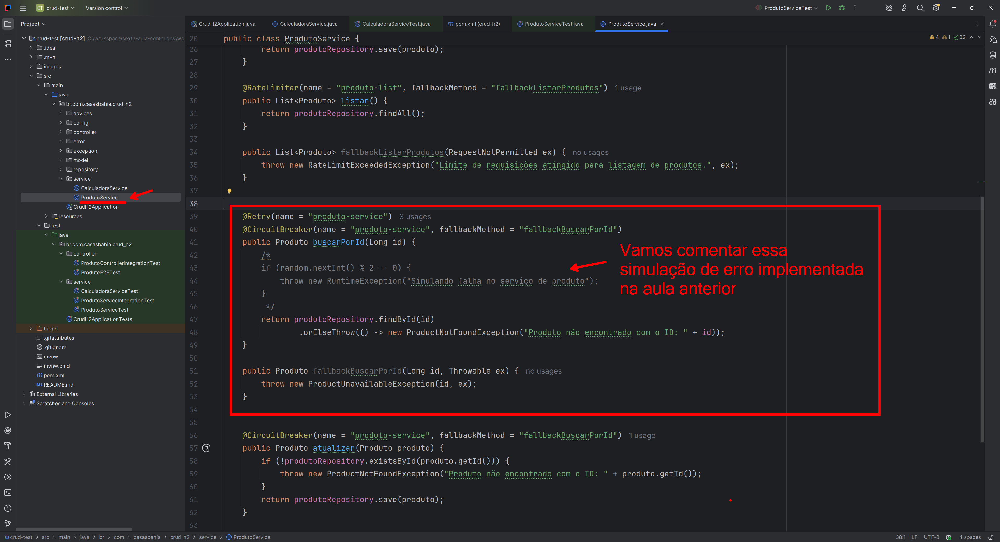

---

## 2️⃣ Testes de Serviço (com Spring Context)

Testam o comportamento da camada de **serviço**, integrando parcialmente dependências reais.

- Segue o código completo de um teste de serviço para a classe `ProdutoService`, utilizando o contexto real do Spring Boot e o banco H2 em memória:

    ```java
    package br.com.casasbahia.crud_h2.service;

    import br.com.casasbahia.crud_h2.model.Produto;
    import br.com.casasbahia.crud_h2.repository.ProdutoRepository;
    import org.junit.jupiter.api.DisplayName;
    import org.junit.jupiter.api.Test;
    import org.springframework.beans.factory.annotation.Autowired;
    import org.springframework.boot.test.context.SpringBootTest;

    import java.math.BigDecimal;

    import static org.junit.jupiter.api.Assertions.*;

    @SpringBootTest
    class ProdutoServiceIntegrationTest {

        @Autowired
        private ProdutoService produtoService;

        @Autowired
        private ProdutoRepository produtoRepository;

        @Test
        @DisplayName("Deve criar produto com sucesso")
        void deveCriarProdutoComSucesso() {
            // Arrange
            Produto novoProduto = new Produto(
                    null,
                    "Produto Teste",
                    "12345678",
                    "Descrição do Produto Teste",
                    BigDecimal.valueOf(100.0),
                    10
            );

            // Act
            Produto produtoCriado = produtoService.criar(novoProduto);

            // Assert
            assertNotNull(produtoCriado);
            assertNotNull(produtoCriado.getId());
            assertEquals("Produto Teste", produtoCriado.getNome());
            assertEquals(novoProduto, produtoCriado);
        }

    }    
    ```

    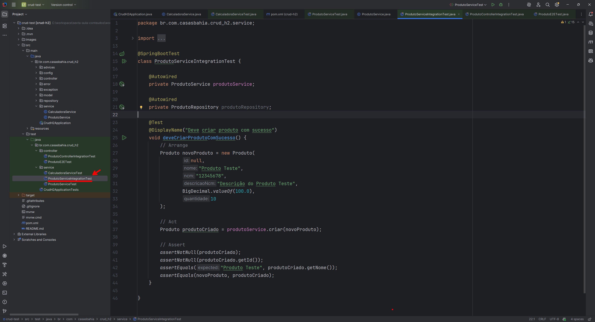


📌 Aqui usamos o **contexto real do Spring Boot**, com o banco H2 em memória.

<br>

Anotações importantes:
* `@SpringBootTest` → carrega o contexto completo.
* `@Autowired` → injeta beans reais.
* Testes mais lentos, mas validam integração real.


---

## 3️⃣ Testes de Integração – *MockMvc*

Usam o **Spring MockMvc** para simular requisições HTTP, sem necessidade de servidor real.

- Segue o código completo de um teste de integração para o controlador `ProdutoController`, utilizando *MockMvc* para simular requisições HTTP:
    ```java
    package br.com.casasbahia.crud_h2.controller;

    import br.com.casasbahia.crud_h2.model.Produto;
    import com.fasterxml.jackson.databind.ObjectMapper;
    import org.junit.jupiter.api.DisplayName;
    import org.junit.jupiter.api.Test;
    import org.springframework.beans.factory.annotation.Autowired;
    import org.springframework.boot.test.autoconfigure.web.servlet.AutoConfigureMockMvc;
    import org.springframework.boot.test.context.SpringBootTest;
    import org.springframework.http.MediaType;
    import org.springframework.test.web.servlet.MockMvc;

    import java.math.BigDecimal;

    import static org.springframework.test.web.servlet.request.MockMvcRequestBuilders.post;
    import static org.springframework.test.web.servlet.result.MockMvcResultMatchers.jsonPath;
    import static org.springframework.test.web.servlet.result.MockMvcResultMatchers.status;

    @SpringBootTest
    @AutoConfigureMockMvc
    class ProdutoControllerIntegrationTest {

        @Autowired
        private MockMvc mockMvc;

        @Autowired
        private ObjectMapper objectMapper;

        @Test
        @DisplayName("Deve criar produto com sucesso via API")
        void deveCriarProdutoComSucessoViaAPI() throws  Exception {

            Produto novoProduto = new Produto(
                    null,
                    "Produto Teste",
                    "12345682",
                    "Descrição do Produto Teste",
                    BigDecimal.valueOf(15.75),
                    10
            );

            mockMvc.perform(
                    post("/api/produtos")
                        .contentType(MediaType.APPLICATION_JSON)
                        .content(objectMapper.writeValueAsString(novoProduto)))
                    .andExpect(status().isCreated())
                    .andExpect(jsonPath("$.nome").value("Produto Teste"));
        }

    }
    ```

    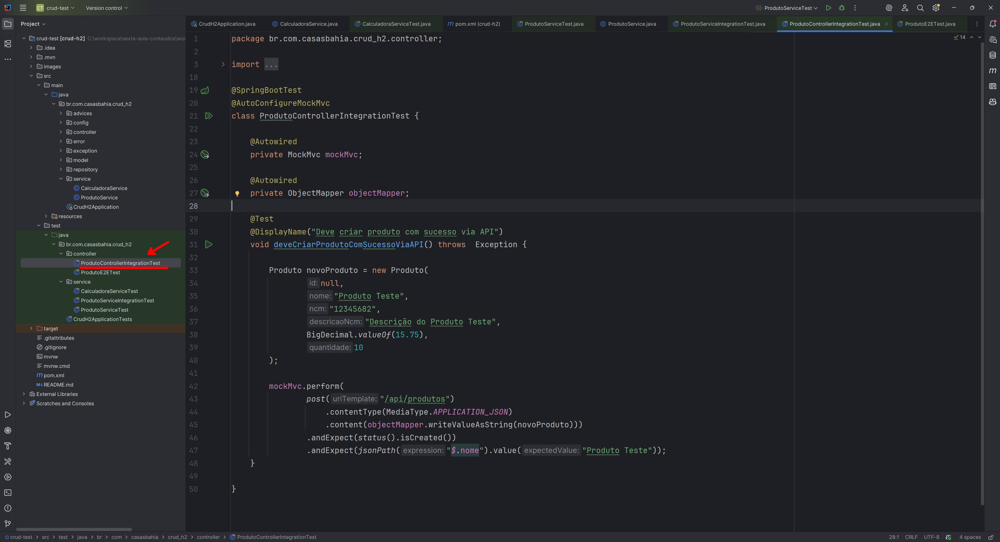

💡 *MockMvc* permite testar controladores REST **sem subir o servidor real**, simulando requisições HTTP completas.

Principais anotações:
* `@AutoConfigureMockMvc` → configura *MockMvc* automaticamente.
* `mockMvc.perform(...)` → simula requisições HTTP.
* `andExpect(...)` → valida respostas HTTP. 


---

## 4️⃣ Testes E2E (Ponta a Ponta)

Testam o fluxo completo, desde o endpoint até o banco.
Utilizam o contexto Spring completo e o banco H2.

- Segue o código completo de um teste E2E (ponta a ponta) para o fluxo completo da API de produtos, utilizando *Spring Boot Test* e *TestRestTemplate*:

    ```java
    package br.com.casasbahia.crud_h2.controller;

    import br.com.casasbahia.crud_h2.controller.dto.ProdutoRequest;
    import br.com.casasbahia.crud_h2.controller.dto.ProdutoResponse;
    import org.junit.jupiter.api.DisplayName;
    import org.junit.jupiter.api.Test;
    import org.springframework.beans.factory.annotation.Autowired;
    import org.springframework.boot.test.context.SpringBootTest;
    import org.springframework.boot.test.web.client.TestRestTemplate;

    import java.math.BigDecimal;

    import static org.junit.jupiter.api.Assertions.*;

    @SpringBootTest(
            webEnvironment = SpringBootTest.WebEnvironment.RANDOM_PORT)
    class ProdutoE2ETest {

        @Autowired
        private TestRestTemplate restTemplate;

        @Test
        @DisplayName("Deve executar fluxo completo de CRUD via API")
        void deveExcecutarFluxoCompletoDeCRUD() {

            // Arrange
            ProdutoRequest novoProduto = new ProdutoRequest(
                    "Produto Teste",
                    "12345681",
                    "Descrição do Produto Teste",
                    BigDecimal.valueOf(15.75),
                    10
            );

            // Act — cria via API (POST)
            ProdutoResponse produtoCriado = restTemplate.postForObject(
                    "/api/produtos",
                    novoProduto,
                    ProdutoResponse.class
            );

            // Assert — verifica se foi criado corretamente
            assertNotNull(produtoCriado, "O produto retornado não deve ser nulo");
            assertNotNull(produtoCriado.getId(), "O ID deve ser gerado");
            assertEquals("Produto Teste", produtoCriado.getNome());


            // Act — busca via API (GET)
            ProdutoResponse produtoEncontrado = restTemplate.getForObject(
                    "/api/produtos/" + produtoCriado.getId(),
                    ProdutoResponse.class
            );

            // Assert — verifica consistência dos dados
            assertNotNull(produtoEncontrado, "O produto buscado não deve ser nulo");
            assertEquals(produtoCriado.getId(), produtoEncontrado.getId(), "Os IDs devem ser iguais");
            assertEquals("Produto Teste", produtoEncontrado.getNome());
            assertEquals(produtoCriado, produtoEncontrado);

        }

    }
    ```

    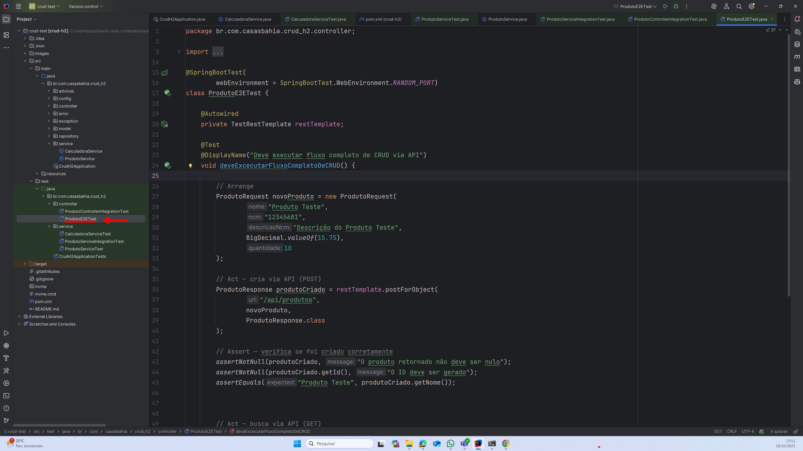

📌 **Spring Boot Test + TestRestTemplate** = integração completa simulando o uso real da API.

Principais anotações:
* `webEnvironment = SpringBootTest.WebEnvironment.RANDOM_PORT` → inicia o servidor em uma porta aleatória.
* `TestRestTemplate` → cliente REST para testes.
* Testa o fluxo completo, do endpoint ao banco. 


---


## ✅ Executando os Testes com Maven

Para executar os testes com Maven, utilize o seguinte comando:

```bash
mvn test
```

* Este comando irá compilar o projeto e executar todos os testes definidos, incluindo testes unitários, de serviço, de integração e E2E.

* Após a execução, o Maven exibirá um resumo dos testes, indicando quantos foram executados, quantos passaram e quantos falharam.


<br>


### 📊 Gerando Relatório de Cobertura com JaCoCo

Para gerar um relatório de cobertura de testes utilizando o JaCoCo, execute o seguinte comando Maven:

```bash
mvn clean verify
```

* O comando `mvn clean verify` compila o projeto, executa os testes e gera o relatório de cobertura.
* Após a execução, o relatório de cobertura estará disponível no diretório `target/site/jacoco/index.html`.

<br>

---

## 📚 Fortalecendo o Conhecimento

### 📖 Leitura Recomendada

* *Effective Unit Testing* — Lasse Koskela
* *Test-Driven Development: By Example* — Kent Beck
* *Clean Code* — Robert C. Martin (Capítulo: “Testes”)

---

## 📌 Conclusão

Nesta aula, aprendemos:

* ✅ Diferenças e finalidades entre tipos de testes (Unitário → E2E).
* ✅ Uso de *JUnit*, *Mockito* e *Spring Boot Test*.
* ✅ Estratégias de isolamento e boas práticas.
* ✅ Importância da cobertura e automação de testes.

A prática constante e a aplicação dessas técnicas garantirão a qualidade e a robustez de suas aplicações Spring Boot.